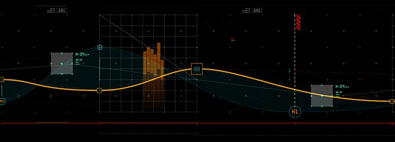

---

<samp> Welcome to the Data Science repository! Here, I have curated a collection of all the basics of data science which includes Basics of Python, NumPy, Pandas and MatPlotLib. All the jupyter notebooks and program implementations are solely based on examples from the book `Python for Data Analysis by Wes McKinney`.
 
Feel free to explore the repository and reach out in case of any issues.
</samp>

# ☘️ Contents

  

<!--toc:start-->

- [☘️ Contents](#️-contents)
  - [ NumPy](#-numpy)
  - [ Pandas](#-pandas)
  <!--toc:end-->

##  NumPy

<samp>

**NumPy** , short for Numerical Python, is the fundamental module required for high-level computation and data-analysis.
Here, You will find all the necessary and important topic-wise notes on understanding Numpy from beginner to advance.
 

</samp>

|     | Topic                        | Description                                                                                         | Link                                                                                                                                        |
| --- | ---------------------------- | --------------------------------------------------------------------------------------------------- | ------------------------------------------------------------------------------------------------------------------------------------------- |
| 1.  | **Numpy Basics**             | <samp> An introduction of `ndarrys` and thier vectorized computation. </samp>                       | [🔗](https://nbviewer.ipython.org/github/abhicodes07/Data-Science/blob/main/02_Numpy_Basics/01_Numpy_Basics.ipynb)                          |
| 2.  | **Data Types**               | <samp> Understanding NumPy data types or `dtype`. </samp>                                           | [🔗](https://nbviewer.ipython.org/github/abhicodes07/Data-Science/blob/main/02_Numpy_Basics/02_Data_Types_for_ndarrays.ipynb)               |
| 3.  | **Indexing and Slicing**     | <samp> Selecting a subset of a data or individual elemenst using indexing and slicing. </samp>      | [🔗](https://nbviewer.ipython.org/github/abhicodes07/Data-Science/blob/main/02_Numpy_Basics/04_Basic_Indexing_and_slicing.ipynb)            |
| 4.  | **Boolean Indexing**         | <samp> Accessing elements of an array using another array as index. </samp>                         | [🔗](https://nbviewer.ipython.org/github/abhicodes07/Data-Science/blob/main/02_Numpy_Basics/05_Boolean_Indexing.ipynb)                      |
| 5.  | **Fancy Indexing**           | <samp> Accessing elements with desired order using Indexing with ndarrays of integers. </samp>      | [🔗](https://nbviewer.ipython.org/github/abhicodes07/Data-Science/blob/main/02_Numpy_Basics/06_Fancy_Indexing.ipynb)                        |
| 6.  | **Transposing and Swapping** | <samp> Operations to flip the dimensions of an array. </samp>                                       | [🔗](https://nbviewer.ipython.org/github/abhicodes07/Data-Science/blob/main/02_Numpy_Basics/07_Transposing_and_Swapping_axes.ipynb)         |
| 7.  | **Universal functions**      | <samp> Functions that performs elementwise operations on data in ndarrays. </samp>                  | [🔗](https://nbviewer.ipython.org/github/abhicodes07/Data-Science/blob/main/02_Numpy_Basics/08_Universal_Functions.ipynb)                   |
| 8.  | **Data Processing**          | <samp> Includes tasks such as concise array expressions that might require using loops. </samp>     | [🔗](https://nbviewer.ipython.org/github/abhicodes07/Data-Science/blob/main/02_Numpy_Basics/09_Data_Processing.ipynb)                       |
| 9.  | **Conditional logic**        | <samp> Express conditional logic as array operation. </samp>                                        | [🔗](https://nbviewer.ipython.org/github/abhicodes07/Data-Science/blob/main/02_Numpy_Basics/10_Conditional_Logic_As_Array_Operations.ipynb) |
| 10. | **Statistical Methods**      | <samp> Mathematical functions which computes statistics about an entire array.</samp>               | [🔗](https://nbviewer.ipython.org/github/abhicodes07/Data-Science/blob/main/02_Numpy_Basics/11_Statistical_Methods.ipynb)                   |
| 11. | **Boolean Methods**          | <samp> Boolean values constitute of 1 (True) and 0 (False). </samp>                                 | [🔗](https://nbviewer.ipython.org/github/abhicodes07/Data-Science/blob/main/02_Numpy_Basics/12_Boolean_Array_Methods.ipynb)                 |
| 12. | **Sorting**                  | <samp> Sorting arrays using sort methods. </samp>                                                   | [🔗](https://nbviewer.ipython.org/github/abhicodes07/Data-Science/blob/main/02_Numpy_Basics/13_Sorting.ipynb)                               |
| 13. | **Unique and Set Logic**     | <samp> Some basic set operations for one-dimensional ndarrays. </samp>                              | [🔗](https://nbviewer.ipython.org/github/abhicodes07/Data-Science/blob/main/02_Numpy_Basics/14_Unique_&_Set_Logic.ipynb)                    |
| 14. | **File Input and Output**    | <samp> Save and load data to and from disk either in text or binary format. </samp>                 | [🔗](https://nbviewer.ipython.org/github/abhicodes07/Data-Science/blob/main/02_Numpy_Basics/15_File_Input_&_Output.ipynb)                   |
| 15. | **Linear Algebra**           | <samp> Useful Linear Algebric in-built functions in numpy namespace. </samp>                        | [🔗](https://nbviewer.ipython.org/github/abhicodes07/Data-Science/blob/main/02_Numpy_Basics/16_Linear_Algebra.ipynb)                        |
| 16. | **Random number generation** | <samp> generates whole arrays of smaple values from many knds of probability distributions. </samp> | [🔗](https://nbviewer.ipython.org/github/abhicodes07/Data-Science/blob/main/02_Numpy_Basics/17_random_number_generation.ipynb)              |

---

##  Pandas

<samp>
    Pandas is a powerful and popular open-source library in Python used for data manipulation and analysis. It provides data structures and functions that make it easy to work with structured data, particularly for tasks like data cleaning, transformation, and exploration.
     
   
</samp>

|     | Topic            | Description                                                                                                                                                                | Link                                                                                                         |
| --- | ---------------- | -------------------------------------------------------------------------------------------------------------------------------------------------------------------------- | ------------------------------------------------------------------------------------------------------------ |
| 1.  | **Introduction** | <samp>Introduction to Pandas and It's Data Structures.</samp>                                                                                                              | [🔗](https://nbviewer.ipython.org/github/abhicodes07/Data-Science/blob/main/03_Pandas/01_Introduction.ipynb) |
| 2.  | **Series**       | <samp>A series is one-dimensional array like object containing an array of data (of any NumPy data-type) and an associated array of data labels, called it's index.</samp> | [🔗](https://nbviewer.ipython.org/github/abhicodes07/Data-Science/blob/main/03_Pandas/02_Series.ipynb)       |

---
